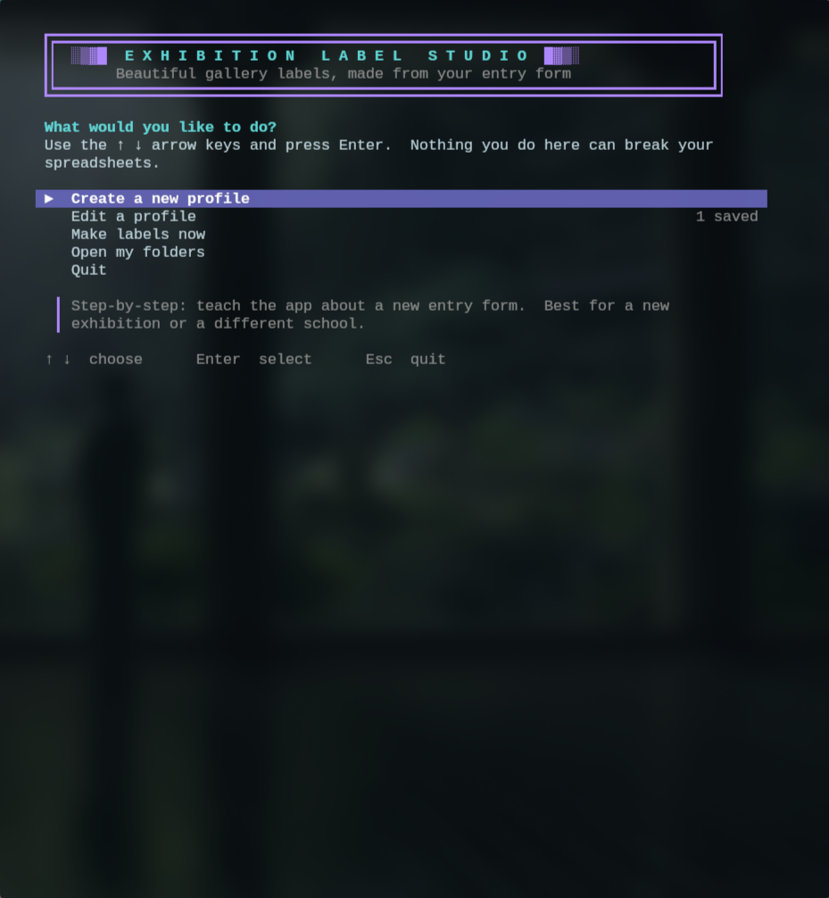
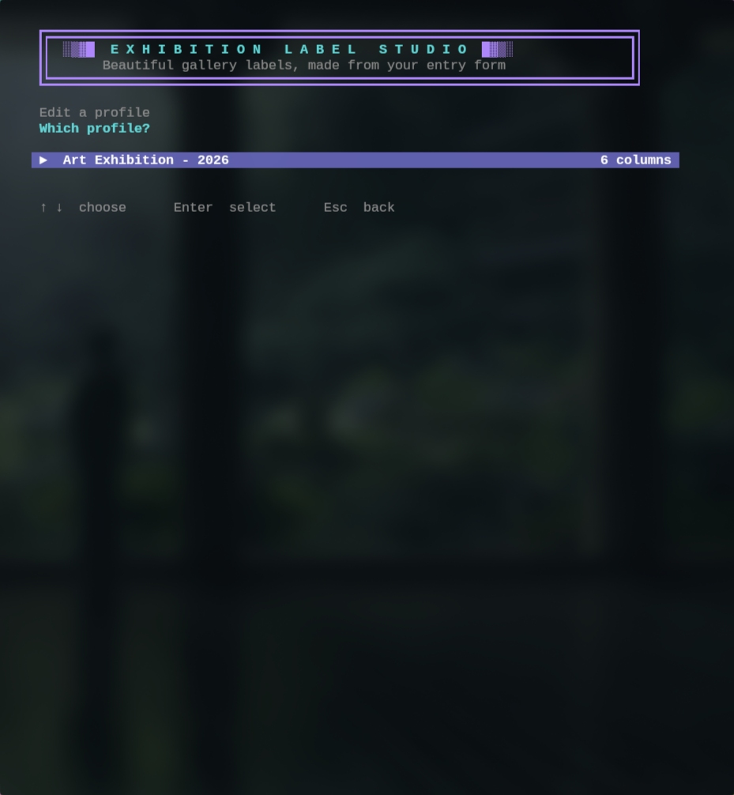
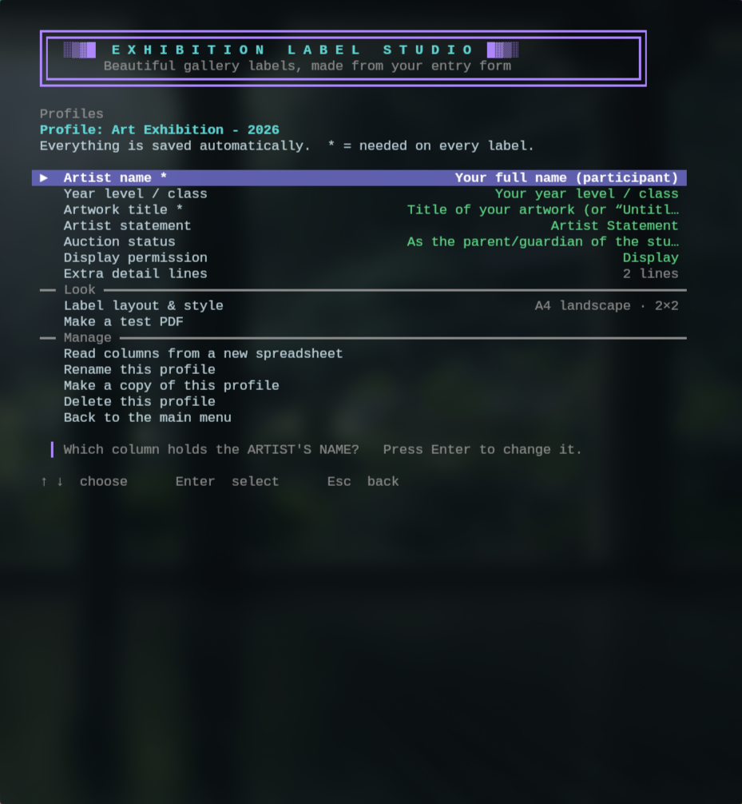
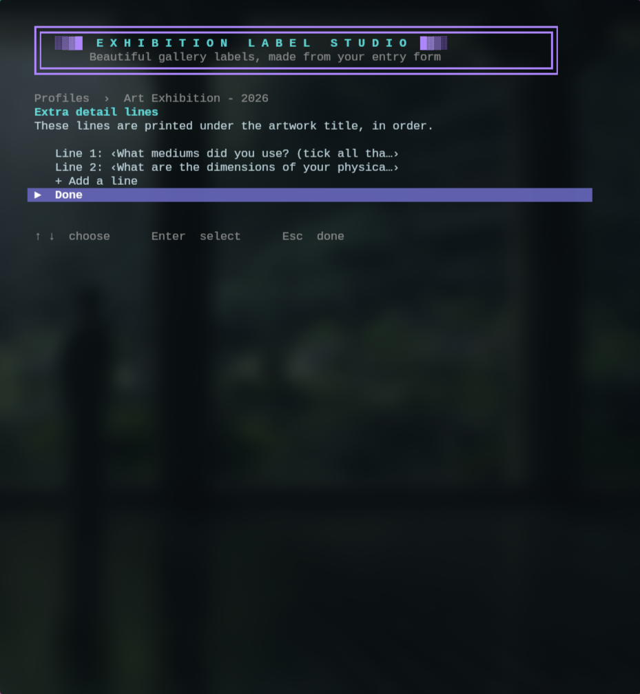
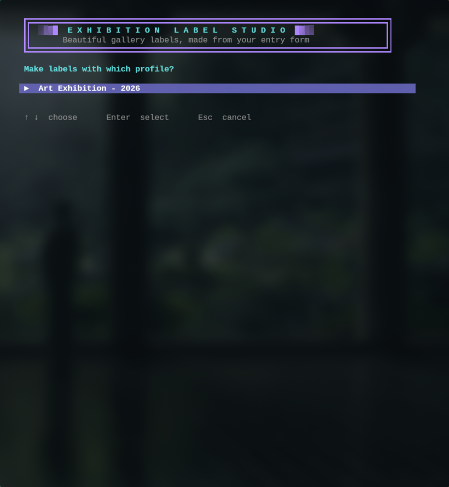
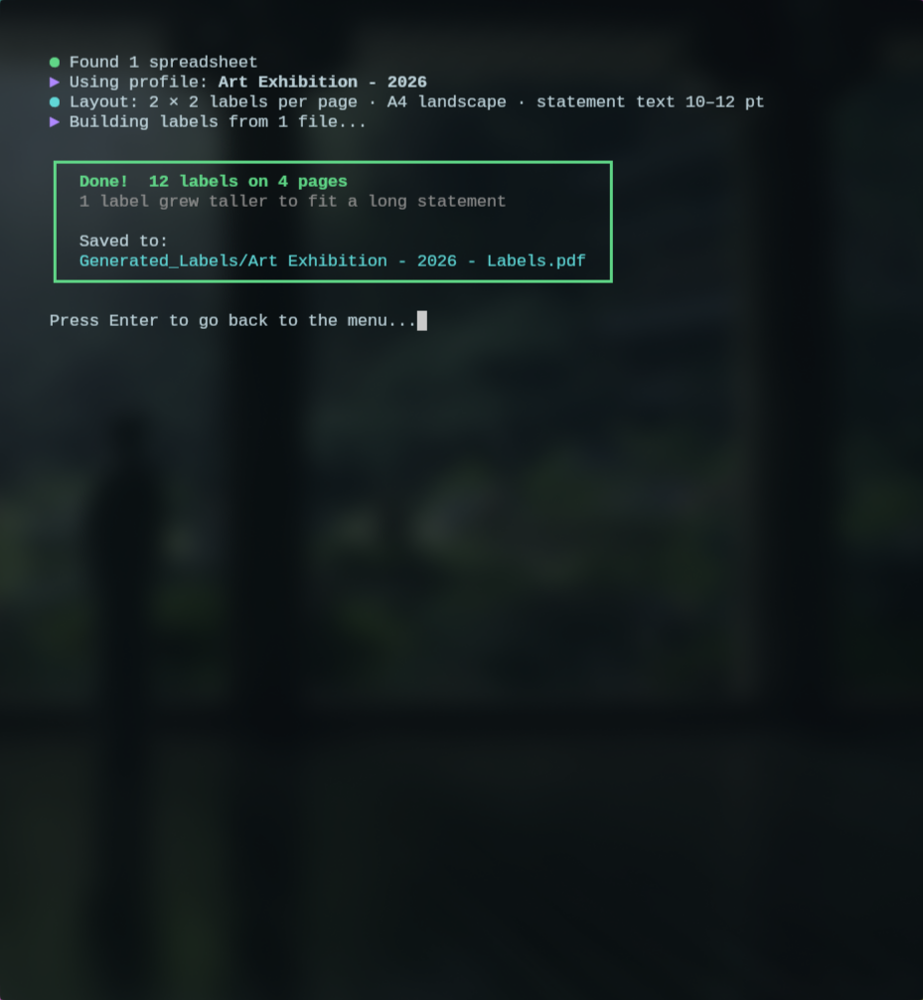
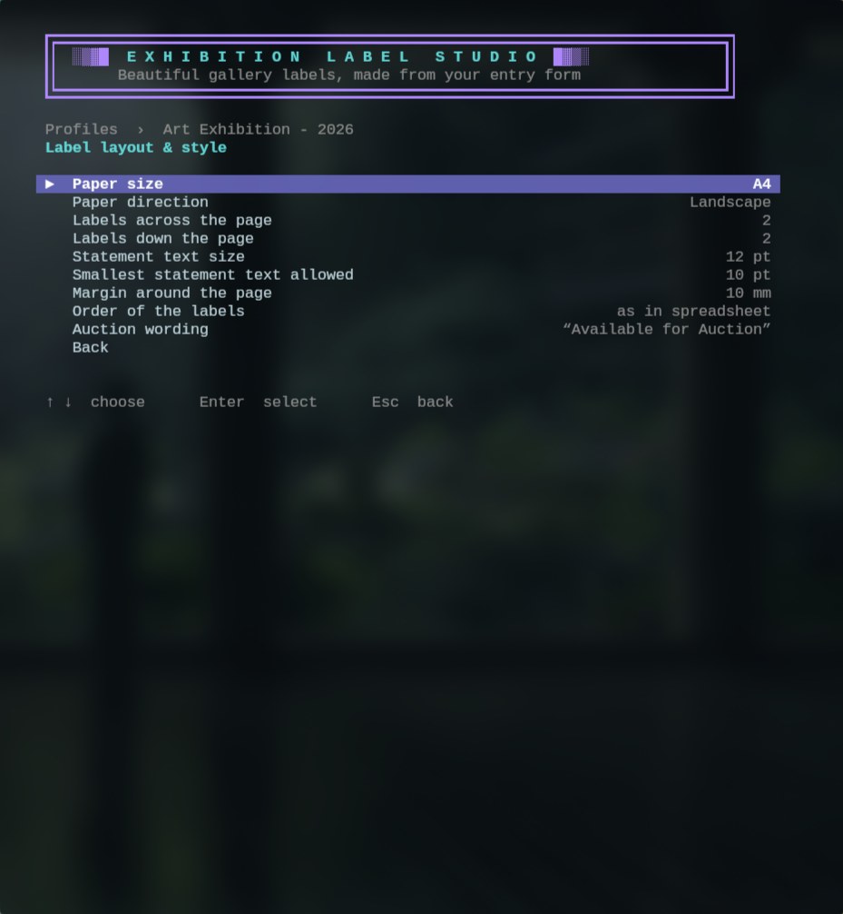

# Exhibition Label Studio - A Form to Label Generator

Built for a school exhibition, but it should be usable for any show.

An automated print pipeline that turns **Microsoft Forms** exhibition submissions into a **print-ready PDF of gallery labels**, replacing a slow manual design process in Canva. A friendly full-screen menu (no coding needed) teaches the app what your form's columns mean, so a new exhibition, a new year or a different school's form is a five-minute job.

---

## Preview

Everything is done from one keyboard-driven menu: **↑ ↓** to move, **Enter** to select, **Esc** to go back.

<table>
  <tr>
    <td align="center" width="50%">
      <br>
      <b>1. Main menu</b><br>
      Create a profile, edit one, make labels, or open your folders.
    </td>
    <td align="center" width="50%">
      <br>
      <b>2. Profiles</b><br>
      One saved profile per form layout, e.g. <i>Art Exhibition - 2026</i>.
    </td>
  </tr>
  <tr>
    <td align="center">
      <br>
      <b>3. Match your form's columns</b><br>
      Pick which spreadsheet column is the artist's name, title, statement and so on.
    </td>
    <td align="center">
      <br>
      <b>4. Extra detail lines</b><br>
      Choose what is printed under the title, such as medium and dimensions.
    </td>
  </tr>
  <tr>
    <td align="center">
      <br>
      <b>5. Make labels</b><br>
      Pick the profile that matches your spreadsheet.
    </td>
    <td align="center">
      <br>
      <b>6. Done</b><br>
      The finished PDF is saved to <code>Generated_Labels/</code> and opens automatically.
    </td>
  </tr>
    <tr>
    <td align="center">
      <br>
      <b>7. Make labels</b><br>
      Pick and choose from a seletion of options like paper size and the gaps between each label!
    </td>
</table>

---

## Purpose

Event submissions arrive via Microsoft Forms. Instead of copying each response into Canva by hand, the app:

1. **Reads** every spreadsheet (`.xlsx`, `.xlsm`, `.csv`) in the intake folder `EXCEL_FILES_HERE/`.
2. **Maps** each row using a saved **profile**, which matches columns by their question text rather than their position, so a shifted or extra column doesn't break anything.
3. **Builds** a uniformly formatted exhibition label for every submission.
4. **Saves** a print-ready, cutter-aligned PDF into `Generated_Labels/`.

---

## Start-up Guide

You need **Python 3** installed. On first launch the launcher creates a private environment and installs `openpyxl` and `reportlab` (internet needed once). This also keeps Linux distributions with PEP 668 protection happy.

### Windows (10 & Beyond)

1. Install Python from [python.org](https://www.python.org/downloads/) and tick **Add python.exe to PATH**.
2. Double-click **`configure.bat`**.

### Linux / macOS

```bash
chmod +x run.sh   # first time only
./run.sh
```

On Debian/Ubuntu you may need `sudo apt install python3 python3-venv` first.

---

## Data Input Workflow

1. In Microsoft Forms, open the responses in Excel (or download them as `.xlsx` / `.csv`).
2. Put the file(s) inside `EXCEL_FILES_HERE/`. Use **Open my folders** in the menu to jump straight there.
3. Launch `run.bat` / `run.sh`.
4. **First time with a new form:** choose **Create a new profile**. Pick an example spreadsheet, name the profile, and confirm each column. The app suggests a best guess (★) for every step, so most of it is just pressing Enter.
5. Choose **Make labels now**, pick the profile and open the PDF.

If you drop in several spreadsheets, they are combined into one PDF. Identical duplicate submissions are skipped automatically. Old `.xls` files should be re-saved as `.xlsx` in Excel first.

---

## Profiles

A profile remembers what each column in a form means. They are kept as small JSON files in the `profiles/` folder (created automatically) and named **`Exhibition Name - Year`**, for example:

```text
profiles/Art_Exhibition.json
```

| Profile field | What it does |
|---|---|
| Artist name * | Printed large at the top of the label |
| Year level / class | Small grey line under the name |
| Artwork title * | Printed in italics inside quotation marks |
| Artist statement | The long paragraph at the bottom of the label |
| Auction status | Green dot (available) or red dot (not for auction) |
| Display permission | Not printed. Used only to warn you if anyone didn't say Yes |
| Extra detail lines | Any columns printed under the title, such as medium or dimensions, each with an optional label |

`*` = needed on every label.

From the **Edit a profile** menu you can also **rename**, **copy** (handy for next year's exhibition) or **delete** a profile, **make a test PDF** of the first six labels, and **read the columns from a new spreadsheet** if the form gains new questions.

When you have more than one profile, the app highlights the one that best matches your spreadsheet.

---

## Visual Output Specifications

### Canvas & Grid (defaults)
- **Sheet:** A4 landscape, with a 10 mm margin so printers don't clip the borders.
- **Grid:** 2 × 2, so **4 standard labels per sheet**.
- **Borders:** every label has a solid mid-grey frame for cutter alignment.
- **Pagination:** automatic, with no trailing blank page.

### How long artist statements are handled

Nothing is ever clipped. The text never drops below 10 pt, as that is too small to read at an exhibition.

1. **Shrink.** Statement text starts at 12 pt and shrinks towards 10 pt to fit the standard label height.
2. **Grow.** If it still doesn't fit at 10 pt, the label grows taller. The row and everything after it moves down.
3. **Go full width.** A label too tall for one column gets a full-width row.
4. **Continue.** A statement longer than a whole page carries on across further pages, marked "continued".

### Typography Hierarchy
| Element | Font | Size | Colour |
|---|---|---|---|
| Artist Name | Bold | 20 pt | Black |
| Year Group / Role | Regular | 11 pt | Grey |
| Artwork Title | Italic, in quotes | 16 pt | Black |
| Detail lines (medium, dimensions…) | Regular | 12 pt | Dark grey |
| Artist Statement | Regular, wrapped | 12 → 10 pt | Dark grey |
| Auction marker | Bold | 10 pt | Green / red dot |

Long names and titles wrap onto a second line instead of running off the label. Arial, Liberation Sans, Noto Sans, DejaVu Sans or Segoe UI is used when installed, so accented letters display correctly. Otherwise the app falls back to Helvetica.

### Layout options

Everything below is set from **Edit a profile → Label layout & style**:

| Option | Choices |
|---|---|
| Paper size | A4, A3, Letter |
| Paper direction | Landscape, Portrait |
| Labels across / down | 1–3 across, 1–4 down |
| Statement text size | 10–18 pt (preferred size) |
| Smallest statement text | 10, 11, 12 or 14 pt (never below 10) |
| Margin | 5–20 mm |
| Order | As in the spreadsheet, artist A–Z, or title A–Z |
| Auction wording | Text beside the green and red dots |

---

## Warnings

The app tells you about problems instead of failing silently:

- A column from the profile can't be found in your spreadsheet.
- The auction column is missing (the marker is left off, so nothing is wrongly shown as "not for auction").
- Someone's display permission isn't a clear **Yes**.
- An auction question was left blank.
- A name or statement contains characters the font can't draw.
- A duplicate submission was skipped.

---

## File Structure

```text
Label_Studio/
├── EXCEL_FILES_HERE/        # ← Drop exported MS Forms data files here
├── Generated_Labels/        # ← Auto-created; PDF output lands here
├── profiles/                # ← Auto-created; one JSON file per form layout
│   └── Art_Exhibition.json
├── screenshots/             # README preview images
├── Generate_Labels.py       # The whole app: generator and configurator
├── run.sh         			 # Launcher for Linux / macOS
├── run.bat            		 # Launcher for Windows
├── venv/                    # Auto-created on first launch (do not commit)
└── README.md
```

---

## Command Line (optional)

The menu covers everything, but the generator can also be run directly with the environment active (`source venv/bin/activate` or `venv\Scripts\activate`):

```bash
python Generate_Labels.py                                        # make labels, using the best-matching profile
python Generate_Labels.py --profile "Art Exhibition - 2026"
python Generate_Labels.py --limit 6                              # first 6 labels only, for a quick test
python Generate_Labels.py configure                              # open the menu
```

---

## Troubleshooting

| Symptom | Cause | Fix |
|---|---|---|
| "Python 3 is not installed" | Python missing, or not on PATH | Install from [python.org](https://www.python.org/downloads/) and tick **Add python.exe to PATH** |
| "Could not create the environment" (Linux) | `venv` module missing | `sudo apt install python3-venv` |
| "Package install failed" | No internet on the first run | Connect once so `openpyxl` and `reportlab` can install |
| "No spreadsheets found" | Data file isn't in `EXCEL_FILES_HERE/`, or is `.xls` | Move it into the folder; re-save `.xls` files as `.xlsx` |
| "Couldn't find the column for …" | The form's question was reworded or removed | **Edit a profile** and pick the column again, or **Read columns from a new spreadsheet** |
| Boxes or blanks where a letter should be | The font has no glyph for that character | Install Arial, Noto Sans or DejaVu Sans |
| A second PDF appears with a time in its name | The first PDF was open in a viewer | Close the viewer. The new copy is fine to use |
| Menu looks squashed | Terminal window is small | Enlarge the window (about 80 × 30 is comfortable) |

---

## |————[ Known Limitation ]————|

- Profiles match columns by their question text. If a form question is reworded, re-pick that column in the profile.
- Only the first sheet of an Excel workbook is read.
- Non-Latin scripts (for example Chinese) need a system font that includes them.
